# HappyPlaceAI

## Description

A Mental Health Support Chatbot that adapts its responses based on user emotions, historical interactions, and personalized coping strategies. The system is designed to work alongside licensed therapists by providing them with summarized insights, behavioral trends, and risk alerts to support more informed and timely interventions. Additionally, with user consent, guardians or trusted individuals can monitor key well-being indicators and receive informations in critical situations, ensuring an added layer of safety and support for the user.

## System Architecture Overview

HappyPlaceAI uses a **Event-Based Layered Architecture**, combining a synchronous layered quanta for user-facing interactions and an asynchronous event-driven quanta for background processing.


### Architectural Quanta

### Quanta 1 — Synchronous (Layered)

Handles all user-facing HTTP interactions. The Vue.js frontend communicates with the FastAPI API layer, reading and writing to PostgreSQL. Each layer has one responsibility and depends only on the layer below it.

**Request flow:**
1. User sends a message via the Chat UI
2. `chat.py` persists the message and retrieves conversation history from Redis (falls back to PostgreSQL on cache miss)
3. `chatbot_service.py` builds the prompt with guidelines and calls the Groq LLM
4. The assistant response is persisted and returned to the user immediately
5. A `message.created` event is published to Redis

### Quanta 2 — Asynchronous (Event-Driven)

Handles all processing that occurs after the response has been returned to the user. Runs as a standalone `analysis_worker.py` process, subscribing to Redis and dispatching events to `handlers.py`.

**Worker flow:**
1. `analysis_worker.py` receives the `message.created` event from Redis
2. `handle_emotion()` runs zero-shot emotion classification via Groq and updates the message record
3. `handle_danger()` checks the message against configured danger keywords
4. If danger is detected, a dashboard alert is created and `danger_flag` is set on the message
5. `emotion_snapshots` and `progress_metrics` are updated for the session and patient

### Redis

Redis serves two distinct purposes:

| Role | Description |
|---|---|
| **Message Broker** | Carries `message.created` events from `publisher.py` to `analysis_worker.py`, fully decoupling the two quanta |
| **Session Cache** | Stores the last 10 messages per active session for fast context retrieval without hitting PostgreSQL on every request |

### Database Schema


## User roles & permissions

### Regular (User / Patient)
**Responsibilities**
- Interact with the chatbot
- Share feelings and experiences
- Follow suggested coping strategies
- Set chatbot behavioral guidelines

**Permissions**
- Chatbot: Write (Send messages)
- Invitation: Write (Send invitation)
- Guideline Settings: Write (Set guidelines)
- Dashboard: None

### Therapist
**Responsibilities**
- Review patient interaction history
- Monitor emotional progress
- Set chatbot behavioral guidelines
- Evaluate coping effectiveness

**Permissions**
- Chatbot: Read (View partial chat logs)
- Invitation: None
- Guideline Settings: Write (Set guidelines)
- Dashboard: Read (Full dashboard access)

### Guardian (Family / Guardian)
**Responsibilities**
- Monitor patient well-being
- View emotional progress

**Permissions**
- Chatbot: Read (View partial chat logs)
- Invitation: None
- Guideline Settings: None
- Dashboard: Read (Full dashboard access)


## Technology Stack

### Backend
| Technology | Purpose |
|---|---|
| FastAPI | REST API framework |
| PostgreSQL | Primary database |
| Redis | Message broker + session cache |
| Groq (LLaMA 3) | LLM provider |
| LangChain | LLM orchestration |

### Frontend
| Technology | Purpose |
|---|---|
| Vue 3 | UI framework |
| Vite | Build tool |
| TypeScript | Type-safe JavaScript |

### Infrastructure
| Technology | Purpose |
|---|---|
| Docker | Containerization |
| Docker Compose | Multi-quanta orchestration |

## Installation & Setup

### Git Clone

Clone the repository and navigate into the project root:

```bash
git clone https://github.com/TeerapatTrepopsakulsin/happyplace-ai.git
cd happyplace-ai
```

---

### Docker

Make sure you have **Docker Desktop** installed and running.

- Download: https://www.docker.com/products/docker-desktop

Verify installation:

```bash
docker --version
docker compose version
```

---

### Environment Variables

In `backend/`, copy `.env.sample` to `.env` and fill in your values:

```bash
cp backend/.env.sample backend/.env
```

> **Note:** When running migrations locally (outside Docker), change `@db:` to `@localhost:` in `DATABASE_URL`.

---

## How to Run

### Docker Compose

**Start all services:**

```bash
docker compose up -d
```

**Stop all services:**

```bash
docker compose down
```

**Run database migrations** (first time):

```bash
docker compose exec backend alembic upgrade head
```

## Screenshots
### Authentication
- **Login Page**
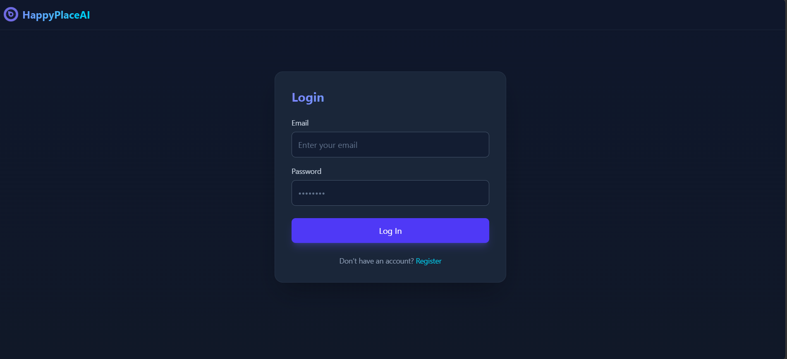
- **Register Page**
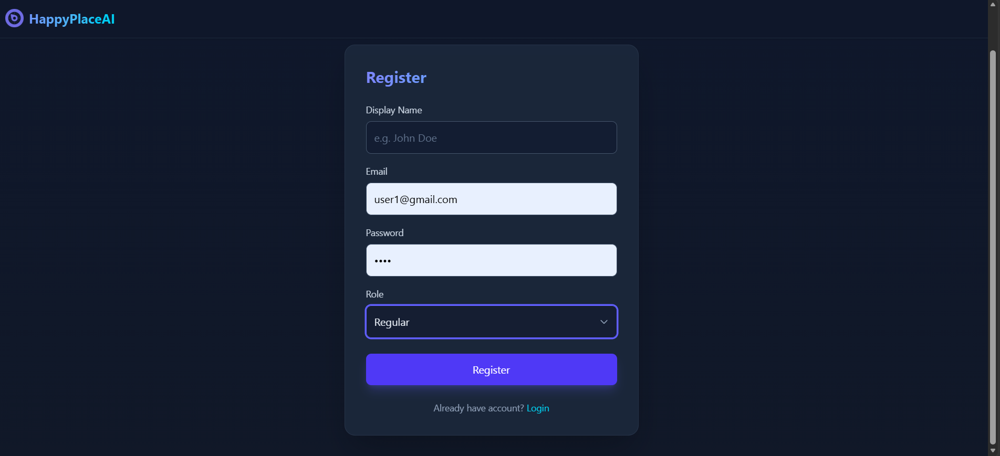

### Regular
- **Chat Page**
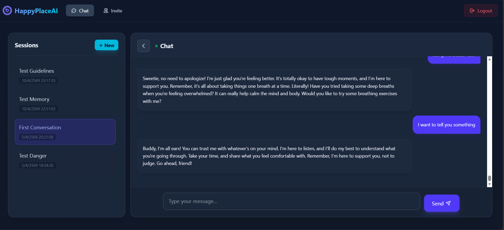
- **Invitations & Collaborations Page**
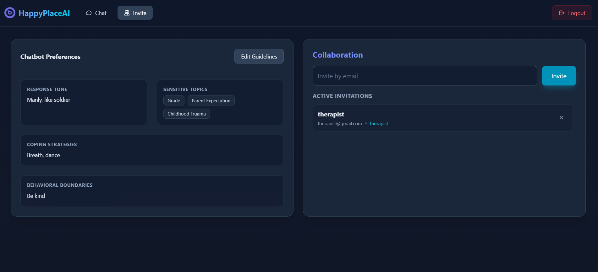

### Therapist
- **Patients List Page**
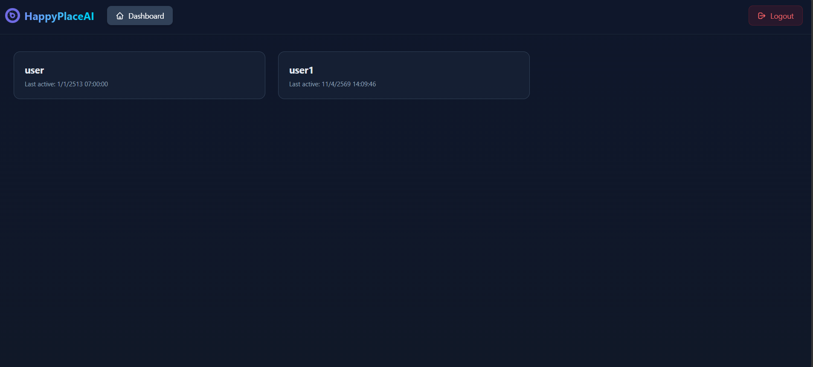

- **Dashboard**
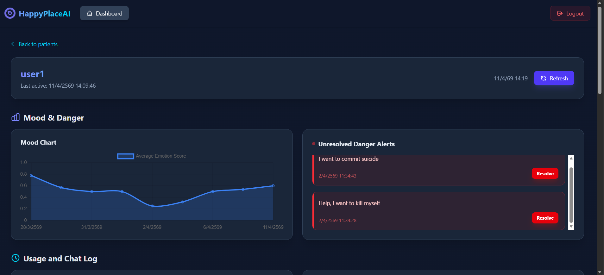
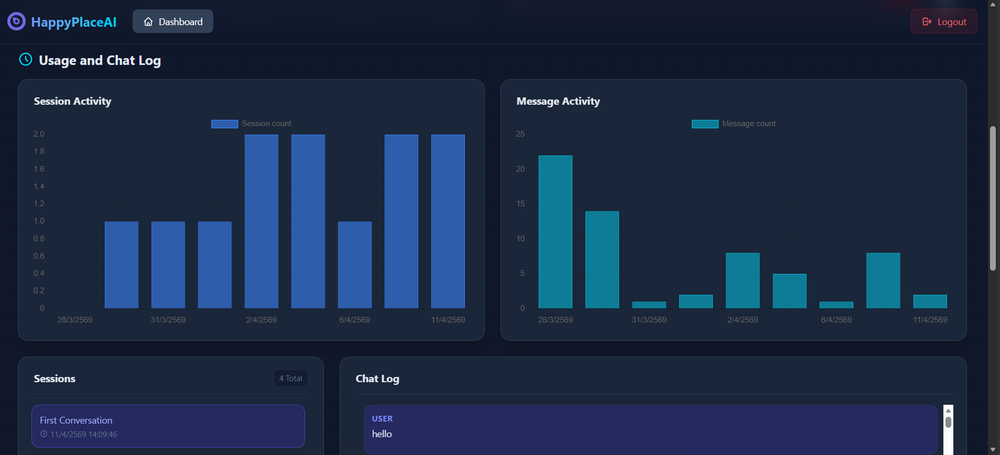
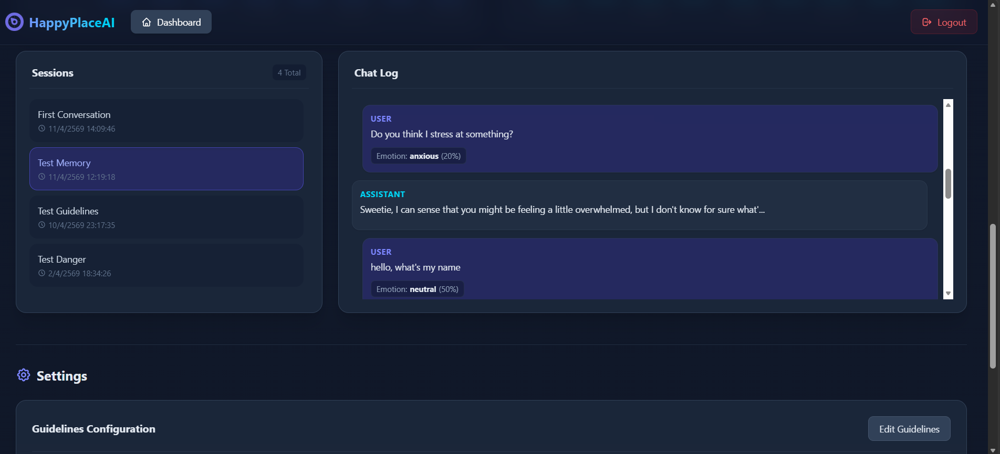
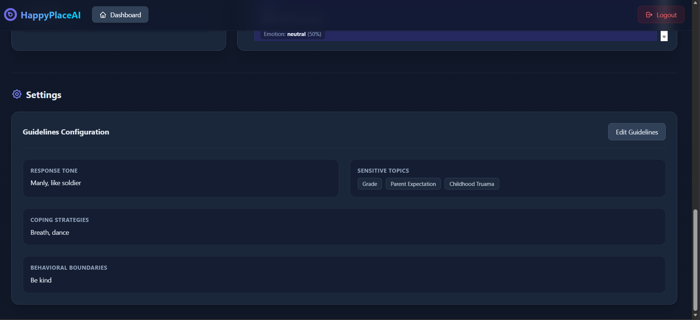

### Guardians
- **Dashboard**
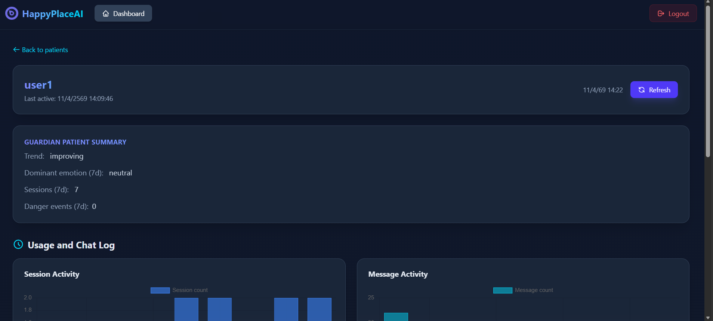
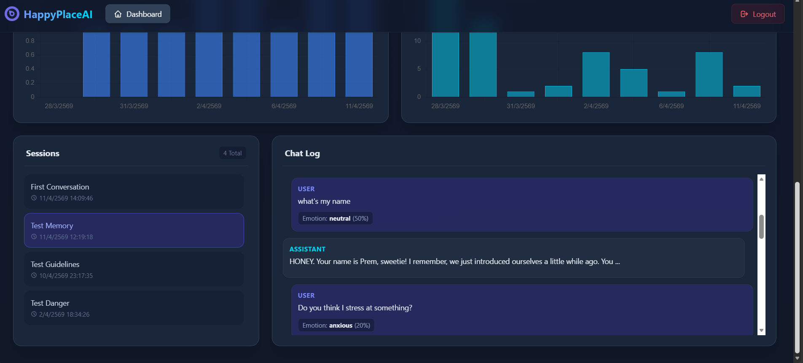
